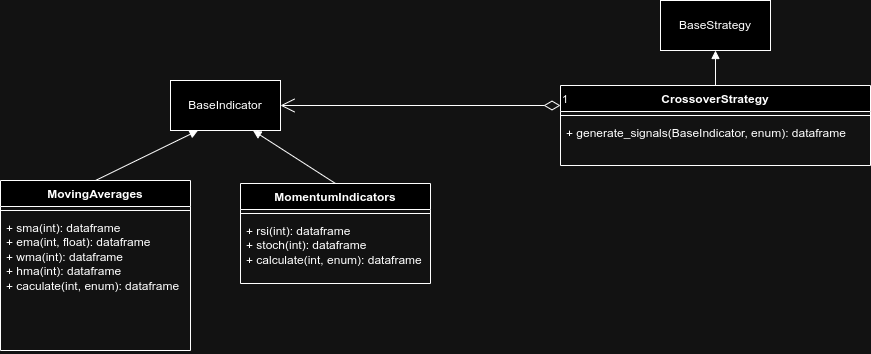

# Trading Proyect


This is a personal project aimed to develop a mvp of trading that is designed to be scalable so it will implement good practices in both code design and architecture design. This project implements a sums algorithm that suggests the user when to buy or sell a digital stop based on indicators and strategies.

## Estructura


- `BaseIndicator`: Base Class for all indicators
 - `MovingAverages`: Implements various moving average calculations including Simple Moving Average (SMA), Exponential Moving Average (EMA), Weighted Moving Average (WMA), and Hull Moving Average (HMA).
 - `MomentumIndicators`: Implements momentum-based indicators such as Relative Strength Index (RSI) and Stochastic Oscillator.
- `BaseStrategy`: Base Class for all trading strategies
 - `CrossoverStrategy`: Implements a strategy based on the crossover of two indicators (typically moving averages). It generates buy and sell signals when a shorter-term indicator crosses above or below a longer-term indicator.


## Design Strategy decision


The code is developed under SOLID principle and modularity


### Modular Trading Module


The Modular Trading Module is a structured approach to developing trading algorithms where indicators and strategies are organized into separate, reusable components. This design promotes flexibility, reusability, and scalability, allowing you to mix and match indicators with different strategies seamlessly.


#### Overview of the Modular Trading Module


##### Key Components:


**Indicators Module:**


Contains classes or functions for calculating technical indicators (e.g., SMA, EMA, RSI).
Indicators are standalone and do not depend on specific strategies.


**Strategies Module:**


Contains classes for different trading strategies.
Strategies use indicators from the Indicators Module to generate trading signals.


**Benefits:**


   Modularity: Clear separation between indicators and strategies.
   Reusability: Indicators can be used in multiple strategies without modification.
   Scalability: Easy to add new indicators and strategies.


#### UML Design


The following UML diagram illustrates the structure of the Modular Trading Module:





This diagram showcases the relationships between the base classes, indicators, and strategies, providing a clear visual representation of the module's architecture.


#### how to use.

For detailed instructions on how to install Docker Compose, please refer to the official documentation: [Install Docker Compose](https://docs.docker.com/compose/install/).


### Running Docker Compose


To run the application using Docker Compose, follow these steps:


1. Ensure you have Docker and Docker Compose installed on your machine.
2. Navigate to the directory containing the `docker-compose.yml` file.
3. Run the following command to start the services:


  ```bash
  docker compose build
  docker compose up -d
  ```


4. Once the services are up and running, you can access the application at `http://localhost:8501`.

